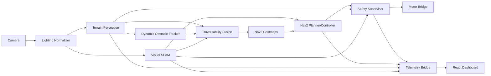

# TECH ARCHITECTURE — DRISHTI-NAV UGV

## 1. Architecture Principle
The latency-critical control loop runs on the **edge computer**.

```text
Camera / IMU / Wheel Odom
          │
          ▼
 Image Capture + Timestamp
          │
          ├──────────────► Raw Evidence Recorder
          ▼
 Adaptive Lighting Normalizer
          │
          ▼
 Terrain / Obstacle Perception
          │
          ├──────────────► Dynamic Obstacle Tracker
          │
          ▼
 Visual SLAM / Odometry
          │
          ▼
 Traversability Fusion
          │
          ▼
  Nav2 Local + Global Costmaps
          │
          ▼
 Planner + Controller
          │
          ▼
 Safety Supervisor
          │
          ▼
      /cmd_vel
          │
          ▼
 Motor Controller
```

The browser dashboard is outside the safety-critical loop.

---

## 2. Logical Components

### 2.1 Camera Node
Responsibilities:
- open selected camera/video/ROS source;
- timestamp at capture;
- publish raw frame;
- detect source disconnect;
- expose FPS and dropped frames.

### 2.2 Lighting Normalizer
Responsibilities:
- estimate brightness/exposure;
- detect glare/darkness;
- optional CLAHE/gamma correction;
- publish normalized frame;
- preserve raw frame.

### 2.3 Terrain Perception Node
Responsibilities:
- segmentation;
- obstacle classes;
- traversability classes;
- confidence;
- inference timing.

Recommended class taxonomy:
- traversable_ground
- rough_ground
- vegetation
- rock
- tree
- wall
- ditch/pothole
- person
- vehicle
- water/mud where dataset supports it
- unknown

### 2.4 Dynamic Obstacle Tracker
Responsibilities:
- short-lived track IDs;
- optical/feature motion;
- estimate movement vector;
- publish predicted occupancy region.

### 2.5 Visual SLAM Adapter
Wrap RTAB-Map / ORB-SLAM3 output into a normalized internal schema:
- pose;
- tracking state;
- keyframe count;
- loop closure;
- feature count if available;
- confidence proxy;
- map/odom transforms.

### 2.6 Traversability Fusion
Combine:
- segmentation;
- obstacle proximity;
- depth/stereo disparity where available;
- temporal stability;
- dynamic obstacle prediction.

Output risk levels:
- 0 Safe
- 1 Caution
- 2 High Risk
- 3 Blocked

### 2.7 Nav2 Stack
Use:
- global costmap;
- local costmap;
- planner server;
- controller server;
- behavior tree navigator;
- recoveries.

Nav2 is designed around planners, controllers, environmental representations/costmaps, and behavior-tree orchestration.

### 2.8 Safety Supervisor
Independent node that can override movement.

Inputs:
- localization confidence;
- perception confidence;
- frame freshness;
- obstacle distance;
- planner state;
- E-STOP input.

Output:
- safety state;
- speed multiplier;
- stop command;
- recovery request.

### 2.9 Mission Manager
Owns:
- mission state;
- destination;
- waypoints;
- pause/resume/cancel;
- mission ID;
- completion criteria.

### 2.10 Motor Bridge
Maps `geometry_msgs/Twist` to:
- differential drive MCU;
- serial;
- CAN;
- PWM bridge;
- simulator.

Keep hardware adapter isolated from navigation logic.

### 2.11 Telemetry Bridge
FastAPI service that:
- subscribes to ROS state;
- exposes REST;
- sends compact WebSocket telemetry;
- serves WebRTC signaling;
- never becomes the sole owner of navigation state.

### 2.12 Evidence Recorder
SQLite + files:
- mission events;
- sampled telemetry;
- images;
- references to rosbag/video logs.

---

## 3. Data Flow



---

## 4. ROS Topic Contract

| Topic | Type | Producer | Consumer |
|---|---|---|---|
| `/camera/image_raw` | `sensor_msgs/Image` | camera | normalizer/recorder |
| `/camera/image_normalized` | `sensor_msgs/Image` | normalizer | perception/slam |
| `/perception/traversability` | custom/grid | perception | fusion/costmap |
| `/perception/obstacles` | custom | perception | tracker/safety |
| `/odom` | `nav_msgs/Odometry` | wheel/VO | localization/Nav2 |
| `/slam/pose` | pose | SLAM adapter | Nav2/UI |
| `/slam/status` | custom | SLAM adapter | safety/UI |
| `/map` | `nav_msgs/OccupancyGrid` | SLAM | Nav2/UI |
| `/plan` | `nav_msgs/Path` | Nav2 | UI |
| `/cmd_vel` | `geometry_msgs/Twist` | Nav2/safety | motor bridge |
| `/safety/state` | custom | safety | UI/mission |
| `/mission/state` | custom | mission | UI |
| `/gps/fix_optional` | `sensor_msgs/NavSatFix` | GNSS | validation/UI |

---

## 5. Low-Latency Video Architecture

### Do
- capture in dedicated thread/process;
- tag capture timestamp;
- inference queue max size = 1;
- overwrite/drop old frame;
- model warmup;
- inference worker isolated from API server;
- WebRTC stream for dashboard video;
- send detection polygons/boxes as metadata;
- draw overlays in the browser when possible.

### Avoid
- base64 video over JSON;
- blocking inference inside FastAPI request;
- unbounded frame queues;
- uploading raw video to cloud before inference;
- cloud round-trip for motor commands.

---

## 6. SLAM Recommendation

### Final Demo Preference
Use stereo or visual-inertial configuration for metric robustness.

### Option A — RTAB-Map
Good for ROS2 integration, mapping, loop closure, stereo/RGB-D workflows.

### Option B — ORB-SLAM3
Good for visual / visual-inertial experiments and advanced localization.

Create an adapter so the rest of the application does not depend on the selected SLAM engine.

---

## 7. Navigation

### Global Planning
Start with:
- NavFn/A* for predictable demo behavior;
or
- Smac planners if rover kinematics require it.

### Local Control
Select based on base:
- differential drive: Regulated Pure Pursuit / DWB / MPPI;
- Ackermann: MPPI or compatible controller.

### Recovery Behavior Tree
Suggested sequence:
1. pause controller;
2. verify fresh perception;
3. clear/update local costmap if safe;
4. scan/reorient;
5. attempt relocalization;
6. replan;
7. resume at reduced speed;
8. restore speed after confidence stabilizes.

---

## 8. Safety Score

Example weighted model:

```text
S = 0.30 * localization_confidence
  + 0.25 * perception_confidence
  + 0.15 * frame_freshness
  + 0.15 * map_consistency
  + 0.15 * planner_health
```

Example thresholds:
- S >= 0.75: GREEN
- 0.50 <= S < 0.75: AMBER
- S < 0.50: RED

Thresholds are configuration values and must be validated experimentally.

---

## 9. Backend API Architecture

```text
FastAPI
├─ REST control/config endpoints
├─ WebSocket telemetry
├─ WebSocket event stream
├─ WebRTC signaling
├─ SQLite access
└─ ROS2 bridge
```

The API server may restart without taking down the ROS safety/control loop.

---

## 10. Frontend Architecture

```text
React + TypeScript
├─ Mission Control
├─ Camera + Overlay Renderer
├─ MapLibre Map
├─ Costmap Renderer
├─ Three.js 3D View
├─ Safety Panel
├─ SLAM Diagnostics
├─ Telemetry Charts
└─ Mission Replay
```

State strategy:
- live telemetry store;
- event store;
- mission configuration store;
- WebRTC media state.

---

## 11. Deployment Modes

### Mode A — Fully Offline
All services on edge computer:
- ROS2;
- FastAPI;
- local static frontend.

Best for final judging reliability.

### Mode B — Free Public Frontend + Edge Backend
- frontend: Cloudflare Pages or Vercel static;
- edge backend: local machine;
- optional Cloudflare Tunnel for HTTPS/public access.

### Mode C — Simulation
- Gazebo;
- same ROS topics;
- same dashboard;
- visible simulation badge.

---

## 12. Cloud Policy
Do not make free cloud compute part of the autonomy loop.

Free web services may sleep/cold-start and are inappropriate for deterministic low-latency control.

A cloud/static host is suitable for:
- frontend assets;
- documentation;
- non-critical metadata;
- optional remote viewer.

---

## 13. Optional Geospatial Mapping
Use MapLibre GL JS.

GNSS rules:
- if real fix exists: place geospatial marker;
- if only a mission-start anchor exists: transform local SLAM displacement into an approximate local ENU overlay;
- always show source and confidence;
- never silently replace SLAM pose with browser GPS.

---

## 14. Security
- local network by default;
- CORS whitelist;
- token/auth for remote control;
- read-only public viewer mode;
- separate operator control role;
- never expose unrestricted motor-control endpoints publicly;
- E-STOP local hardware/software route remains authoritative.

---

## 15. Observability
Each node publishes:
- `healthy`;
- `last_update`;
- `latency_ms`;
- `error_code`;
- optional `restart_count`.

Dashboard provides a health matrix.

---

## 16. Recommended Development Hardware Profile
For development, an NVIDIA laptop GPU can run the perception model locally using CUDA and later export to ONNX/TensorRT where appropriate. The project must retain a CPU/replay fallback for judges who run it on different hardware.
