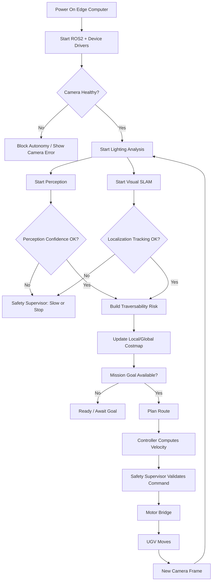
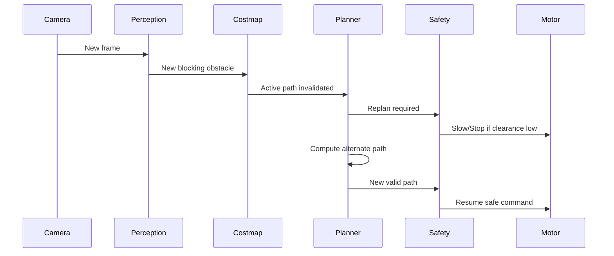
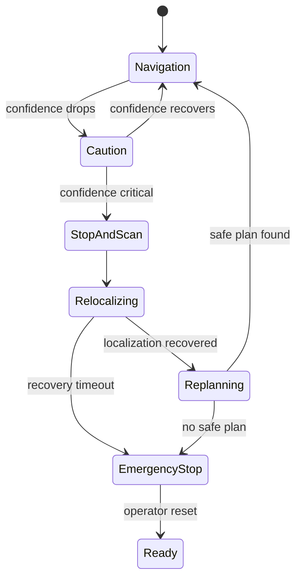

# WORKFLOW — DRISHTI-NAV UGV

## 1. End-to-End Runtime Workflow

## 2. Startup Workflow
1. Load environment/configuration.
2. Start ROS2.
3. Detect camera.
4. Verify calibration file.
5. Start capture.
6. Start SLAM.
7. Start perception.
8. Start Nav2.
9. Start safety supervisor.
10. Start motor bridge.
11. Start recorder.
12. Start FastAPI telemetry bridge.
13. Start WebRTC.
14. Open dashboard.
15. Run health checks.
16. Enter `READY` only when mandatory services are valid.

## 3. Mission Creation Workflow
1. Operator clicks `New Mission`.
2. Enter name.
3. Select mode.
4. Select camera source.
5. Optionally acquire GNSS/start anchor.
6. Confirm local map/SLAM tracking.
7. Set goal/waypoints.
8. Preview route.
9. Start mission.
10. Recorder creates mission ID and event stream.

## 4. Normal Autonomous Navigation
1. Camera captures latest frame.
2. Normalize frame if necessary.
3. Perception produces terrain/obstacle output.
4. SLAM updates pose.
5. Fused risk grid updates.
6. Nav2 updates costmap.
7. Planner/controller generates route/control.
8. Safety supervisor validates.
9. Motor command is issued.
10. Telemetry/logging updates.

## 5. Sudden Obstacle Workflow

UI event:
`ROUTE_REPLAN: obstacle intersected path`

## 6. Low Localization Confidence
Trigger examples:
- feature count below threshold;
- SLAM tracking degraded/lost;
- frame too dark;
- motion blur;
- map inconsistency.

Workflow:
1. change safety state to AMBER;
2. lower maximum velocity;
3. if confidence falls further → RED;
4. publish zero velocity;
5. enter STOP_AND_SCAN;
6. collect fresh keyframes;
7. attempt relocalization;
8. on success update pose/costmap;
9. replan;
10. resume slowly;
11. return to GREEN after stable interval.

## 7. Stop-and-Scan State Machine

## 8. Camera Failure
1. camera heartbeat timeout;
2. safety supervisor immediately stops movement;
3. dashboard shows `CAMERA LOST`;
4. inference stops;
5. SLAM state marked invalid/degraded;
6. motor remains stopped;
7. attempt reconnect;
8. require stable frames before resuming.

## 9. Internet Failure
No change to local navigation.

Expected behavior:
- dashboard on remote public URL may disconnect;
- local UGV control continues;
- logs continue locally;
- operator on local network can still connect;
- remote tunnel can reconnect later.

## 10. GNSS Failure
No change to navigation.

Expected behavior:
- geospatial map marks GNSS unavailable;
- SLAM/local coordinates continue;
- mission remains valid.

## 11. Emergency Stop
When pressed:
1. safety state becomes `EMERGENCY_STOP`;
2. zero velocity command is published immediately;
3. stop is latched;
4. planner may continue computing but cannot move vehicle;
5. reset requires explicit operator action;
6. reset allowed only when mandatory sensors are healthy.

## 12. Mission Complete
1. goal tolerance reached;
2. send zero velocity;
3. state = `MISSION_COMPLETE`;
4. close active trajectory;
5. save metrics;
6. finalize event log;
7. generate mission summary;
8. enable replay.

## 13. Replay Workflow
1. choose mission;
2. load timestamps/events;
3. load video/frames;
4. synchronize map pose;
5. synchronize safety and planner events;
6. scrub timeline;
7. export metrics.

## 14. Calibration Workflow
### Monocular Camera
- capture calibration board;
- estimate intrinsics/distortion;
- save YAML;
- validate reprojection error.

### Stereo Camera
- calibrate both cameras;
- estimate relative transform;
- validate baseline;
- test depth/disparity.

### IMU
- verify axes;
- verify timestamps;
- verify frame transform.

### Wheel Odometry
- drive measured straight distance;
- compare expected vs reported;
- adjust scale.

## 15. Jury Demonstration Workflow
1. Open Mission Control.
2. Show real camera device.
3. Show raw/normalized view.
4. Show live path segmentation.
5. Show SLAM tracking/trajectory.
6. Set goal.
7. Start autonomous navigation.
8. Place a new obstacle.
9. Show detection → costmap → replan.
10. Force a difficult visual condition.
11. Show automatic Stop-and-Scan.
12. Recover.
13. Reach goal.
14. Show metrics and mission replay.
15. Disable/cover GNSS reference and explain that local visual navigation is still active.
